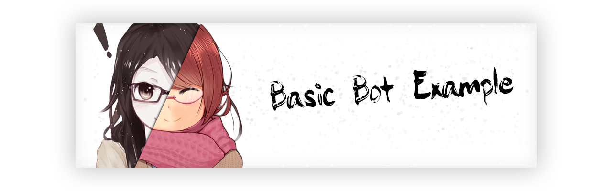

    

# Basic Starter Bot Project

## What Is This

### This is a basic bot you can use as a base for your Discord Bot Project, it has comments on all the main things you need to know. It's also using the latest best practices in terms of Dependency Injection and Services

## Getting Started

- To get started you're going to want to fork this repository [Shown Here](https://help.github.com/articles/fork-a-repo/).
- Once you have a fork, naviagte to it on Github (It should now be under your own accounts repo's)
- [Clone](https://help.github.com/articles/cloning-a-repository/) your fork to your local machine.

Once you have the clone of your fork on your computer. Simply Navigate to it on your computer and open the `BasicBot.sln` file. This will open the project in Visual Studio.

- Once you have the project open, the first thing you will want to do is run it in debugger. This forces the bot to make the `config.json` file that you can use to store your `token` in as-well as `game-status`. You can also add tot his file if you want in future (Learning how to do that is up to you however you can come to the Discord server linked at the bottom if you wish to get more info).
- Initially the bot should not run as it will give you an error saying your config wasn't filled out and also give an error saying it couldn't connect to discord. Don't worry, this is normal.
  - **NOTE:** The token is located in `bin/Debug/netcoreapp2.2/`
- Once you have filled out the bot config, you can now run the bot again in the debugger and it should connect to discord.
  - **NOTE:** You can find information [Here](#Token) on how to get a Discord Bot Token, as-well as how to connect to your server.
- Once the bot is connected to your discord server, you can test it by running the command `@YourBotsName hello`. This is a basic command I have included in the project.

## Token

How to get your Discord Token and Invite the Bot to your Discord Server.

- First go [Here](https://discordapp.com/developers/applications/)
- Login with your Discord Username and Password (If it takes you away from that page after you login, come back here and click the link above again).
- Once on that page you should see something that looks like the image below.

- You may not have any Bots yet, to create a project just click on the button that says `Create an application`.
- Once you click that, it should make a new app for you, give it the name you wish to call your bot as-well as a picture and description if you wish.
- Once done you should have something that looks like this.

- What you need to do now is goto the button that says `Bot`
- It should give you a window like this

- Click on the button that says `Add Bot` then click `Yes Do it`
- You should have something now that looks like this

- Click on `Copy` under the token section and paste your token into the `config.json` file.
- **NOTE: It is incredibly important that you DO NOT EVER let anyone else get a hold of this token. It should be kept private at all times!**

## Inviting

Inviting the bot to your discord server.

- Start by clicking on the button that says `OAuth2`
- That should present you with something like this

- Put a checkmark in the box that says `bot`
- Also check on boxes for any permissions you want to give your bot on your discord server as-well.

- Once you are done, click on the `Copy` button and paste the URL into your browser. 
- It will pop up with a list of servers you're allowed to add your bot to.
- Select the sever you want to add it to and click `Authorize`
- Click the botton to declare you're not a bit yourself.
- Your bot should now be in your Discord Server.

If you have done everything correctly, you should be able to run your bot in the Visual Studio Debugger and your bot will come online.

---

That's it. If you have any issues using this or just need some help adding to it use the links below to find me on Discord.

Author: Draxis#0359

Discord:  [Discord-BOT-Tutorial Server](https://discord.gg/cGhEZuk)